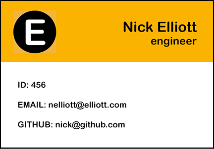
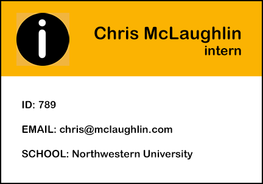
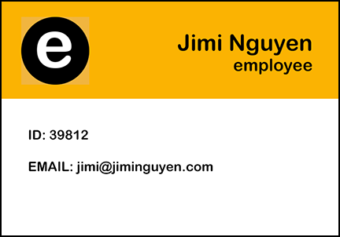

# 10 Team Profile Generator

### Description
* Company staff contact engine
* Node CLI compiles entered company roster/contact information

### Motivation
* Week 10 homework for Full-Stack Coding Bootcamp at Northwestern University
* Exercise utilizing my newly found knowledge of Object-Oriented Programming (OOP)

### Contributors
* NU student Tressa Park
* Tutor Vivian Nguyen

### Tech Used
* JavaScript
* node.js

### Build Status
* Coding is 75%
* Images are 25%

### My Idea for Graphics

### Screenshot of User Input

### Screenshot of Employee Contacts
